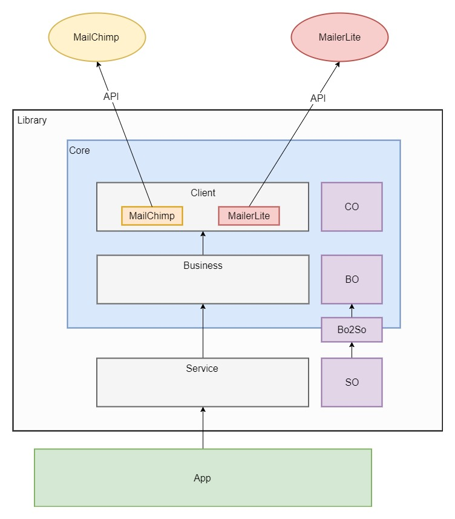

## Задание
Написать библиотеку для работы с интеграциями.

## Решение

Проект сделан как Symfony bundle, можно адаптировать под другой фреймворк.

Каждый объект задач в массиве по сути является некоторой командой.
В данном случае это команда на подписку. Но это не исключает расширение библиотеки в будущем
и добавление команды, например, для отписки.

Проект разделен на три слоя:
* **Service** - внешний слой, через него происходит взаимодействие с библиотекой.
Т.е. библиотека выступает как сервис. В папке **SO** модели *Service Object*.
Эти модели являются контрактом для работы с внешним миром.
* **Business** - слой бизнес-логики. В папке **BO** модели *Business Object*.
* **Client** - слой непосредственного взаимодействия с сервисами. Библиотека
выступает как клиент к API сервисов. В данном случае были использованы готовые библиотеки
для ускорения разработки. В папке **CO** модели *Client Object*.
Эти модели строятся на базе документации сервисов.



Рассмотрим структуру папки Service:
* **Bo2So** папка с конвертерами.
* **Business** основная логика.
* **SO** модели.

Структура папки **SO**:
* *Command* - команды
    * *Subscriber* - сущность, над которой производятся действия.
        * *Subscribe* - действие над сущностью (подписаться).
            * *Settings* - настройки по интеграциям
            * *LeadSO* - модель для хранения имени и email
            * *SubscribeCommandSO* - класс команды, состоит из данных и настроек по интеграциям.
        * *Unsubscribe* - пример, действие над сушностью (отписаться).
    * *Account* - пример, сущность для работы с данными аккаунта.
        * *Get* - пример, получение данных по аккаунту (списки).

Для сериализации используем JMS\Serializer.
Валидацию объектов и обработку ошибок опустил на данном этапе.

Возможно не самое лучшее решение, нужно больше исходных данных.
Какие интеграции, какие функции могут быть в дальнейшем.

## Результат

Подписчики добавляются в MailChimp и MailerLite.
Изменил идентификаторы groupId и listId существующих списков.

## Установка

Выкачать проект. Перейти в папку с проектом.
Выполнить команду:
```console
composer install
```

## Тестировани

```console
.\vendor\bin\phpunit --bootstrap vendor/autoload.php tests/ClientFunctionalTest
```

## Обратная связь

Интересна обратная связь по библиотеке.